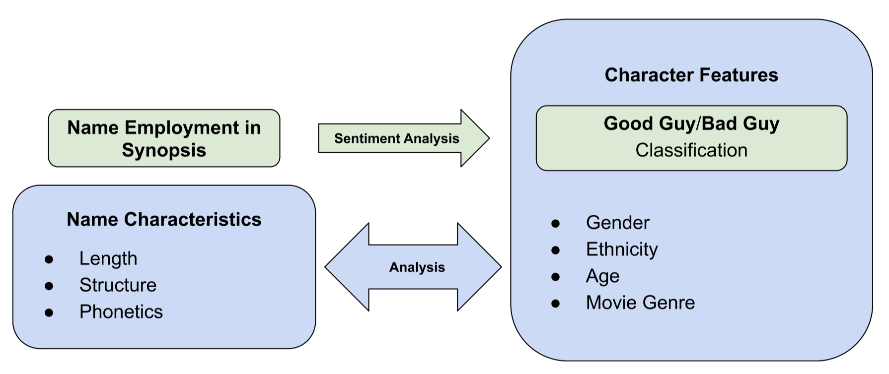

# ADAdasurmonbidet2024 - DISCOVER CHARACTERS' FEATURES BASED ON FIRST NAME

## Project Ideas
In film storytelling, a character’s name is rarely just a label; it often serves as a subtle cue to their personality and role in the movie. Our project tackles the intriguing question: **"Can a character’s archetype be predicted from their name?"** Through this data analysis project, we aim to decode connections between specific name characteristics — such as length, structure, cultural origin, and phonetics — and features including gender, narrative role, movie genre-specific role, and additional properties that we expect to uncover through deeper analysis. A sentiment analysis will also allow us to explore whether these name characteristics and features evoke positive or negative associations, potentially correlating with archetypes such as hero, villain, or more nuanced characters, if time permits.

## Research Questions
- What are the key predictors of character traits based on first names?
- Can the number of vowels, consonants, or specific sounds in a name correlate with the character’s role (e.g., hero, villain)?
- How do the length and structure of a character’s first name correlate with their role in the narrative? Do longer or more complex names correspond to more prominent or villainous roles in films?
- Can sentiment analysis of names offer insights into character traits?
- Do films produced in specific regions tend to use names that align with the cultural background of the characters? For example, do American films predominantly feature Anglo-Saxon names for protagonists and villainous roles?

## Additional Dataset
We propose integrating a dataset that associates each first name with its ethnicity, which would allow us to make the ethnic origin of the names one of the characteristics of our analysis. This would enable us to, for example, explore the relationship between the origin of a name and the location where the films are produced. The dataset we have identified, "Name Ethnicity," is available on Kaggle.

## Project Plans and Methods

### Step 0: Data Exploration
We began with data cleaning, removing irrelevant columns and rows, particularly those missing the character name. For preprocessing, we isolated first names by:
- Stripping out prefixes (e.g., “Dr. Alison Parker” becomes “Alison Parker”)
- Eliminate commun names like “taxi” or “waiter” using `nltk.corpus.words`. 
- From the filtered data, restore words identified as valid names using the `nltk.corpus.names` library, which provides a list of English names. 
- Keeping only the first name from full names (e.g., “Alison” from “Alison Parker")

The cleaned data was saved in th `cleaned.csv` file for streamlined analysis.

### Step 1: Present globally the data

### Step 2: Feature Extraction for Name Analysis
We examined the name characteristics to devide the genders for the rest of our analysis. We extracted several characteristics of the names :
- Length (using Python’s `len()` function)
- Structure (vowel and consonant count using `pandas`, first and last letters)

** For P3 : ** These name characteristics will be added so we can
- Ethnicity
- Phonetics
We will merge the "Name Ethnicity" dataset and apply phonetic analysis using algorithms like Soundex or Metaphone to explore pronunciation patterns and trends related to names.

### Step 3: Understanding the Data
To better understand the relationships between character names and movies, we started by looking at the data to identify patterns and formulate hypotheses. Our goal was to find trends in character features, such as the distribution of names across different movie genres.

### Step 4: Study of Correlations Between Name Characteristics and Character Features
We plan on identifying correlations in the data, especially between name characteristics and character features. We will examine whether certain sounds are tied to specific genres or character roles and explore the influence of filming locations on name origins.

### Step 5: Sentiment Analysis
The goal is to analyze the connotations of character names and how they are linked to character traits. We will conduct sentiment analysis on sentences featuring these names, identifying structures and adjectives to determine if the names have positive, negative, or neutral connotations. Phonetic analysis will further explore whether phonetic traits (like name length or consonant count) correlate with specific roles, such as villains.

### Step 6: Predictive Model & Generative List of Heroes/Villains
Our aim is to develop a “Character ID” model that predicts the most likely characteristics of a movie character based on their first name. The model would generate a character profile, including attributes such as age, ethnicity, gender, and whether the character is a villain or hero. Additionally, we plan to generate a list of first names most commonly associated with villains or heroes in films.

### Step 7: Create Data Story

## Organisation:
COMPLETER

## Proposed Timeline
- **22.11.2023**: Step 1 to 3
- **29.11.2024**: Homework 2
- **13/12/2023**: Step 4 to 5
- **18.12.2023**: Step 6 to 7
- **20.12.2023**: Deadline Milestone 3