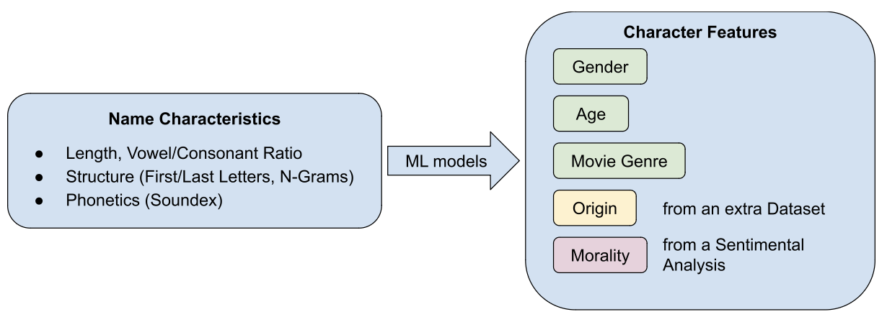

# [ADAdasurmonbidet2024 - DISCOVER CHARACTERS' FEATURES BASED ON FIRST NAME](https://fannymissillier.github.io)

## Project Idea
In film storytelling, a character’s name is rarely just a label; it often serves as a subtle cue to their personality and role in the movie. Our project tackles the intriguing question: **"Can a character’s archetype be predicted from their name ?"** Through this data analysis project, we aim to decode connections between specific name characteristics — such as length, structure and phonetics — and the characters' features including gender, age, the movie genre, its origin and even its morality. 

Additionally, we will investigate how naming conventions differ across contexts, with a particular focus on comparing movie productions from the United States. Specifically, we aim to identify strong correlations between the portrayal of "nice guys" and "bad guys," focusing on potential differences in the depiction of Soviet characters versus American characters.

## Research Questions

About discovering characters' features based on their first name: 
- Is there a correlation between a characters' name and their **gender** ?  
- Can we observe a relationship between a character's name and their **age** ?  
- How does a character's **origin** influence their name ?  
- Are character names linked to the **movie genre** they appear in ?  
- Is there a pattern in character names that distinguishes **Nice guys** from **Bad guys** in movies ?  

About how naming conventions differ across contexts: 
- How do naming conventions in U.S. movie productions during the Cold War reflect ideological narratives, particularly in the portrayal of Soviet characters as "good guys" or "bad guys" ?  

## Datasets

### CMU Movie Summary Corpus
The **CMU Movie Summary Corpus** is a dataset provides a detailed view of over 42,000 movie plot summaries, extracted from Wikipedia and aligned with metadata from Freebase:

- **Movie Metadata**:
  - Box office revenue
  - Genre
  - Release date
  - Runtime
  - Language

- **Character Information**:
  - Names of characters
  - Metadata aligned with the actors who portray them, including:
    - Gender
    - Estimated age at the time of the movie's release

- **Processed Data Supplement**:
  - Stanford CoreNLP-processed summaries, which include tagging, parsing, Named Entity Recognition (NER), and coreference resolution.

**Source**: [CMU Movie Summary Corpus](http://www.cs.cmu.edu/~ark/personas/)

---

### Name Ethnicity Dataset
The **Name Ethnicity Dataset**, sourced from Kaggle, provides a collection of names alongside their corresponding ethnic origins. 

**Dataset Features**:
- **Name Data**:
  - First and last names
- **Associated Metadata**:
  - Country of origin
  - Ethnicity information

**Source**: [Name Ethnicity Dataset on Kaggle](https://www.kaggle.com/datasets/tommylariccia/name-ethnicity-data)

## Repository Organization

## Methods 

### 0. Data Exploration and Cleaning
We began with data cleaning, removing irrelevant columns and rows, particularly those missing the character name. For preprocessing, we isolated first names by:
- Stripping out prefixes (e.g., “Dr. Alison Parker” becomes “Alison Parker”)
- Eliminate commun names like “taxi” or “waiter” using `nltk.corpus.words`. 
- From the filtered data, restore words identified as valid names using the `nltk.corpus.names` library, which provides a list of English names. 
- Keeping only the first name from full names (e.g., “Alison” from “Alison Parker")

The cleaned data was saved in the `cleaned.csv` file for streamlined analysis.

### 1. Feature Extraction for Name Analysis
We extracted the followinf name characteristics:
- Length, vowel and consonant counts
- Structure : 
    - first and last letters
    - n-gram 
- Phonetics (Soundex)

We proved significant differences in the structure of female/male names.

### 2. Hypothesis Making
To better understand the relationships between character names and movies, we started by looking at the data to identify patterns and formulate hypotheses. Our goal was to find trends in character features, such as the distribution of names across different movie genres, countries and ages.

### 3. Study of Trends Between Name Characteristics and Character Features from the Dataset
We identified statistically significant associations between certain names features and character features from the CMU Movie Summary Corpus Dataset (Genre, Age and Movie Genre). Then we created 3 models to link the Character Names to a Genre, Age and Movie Genre.

### 4. Creating a Model from Name Ethnicity Dataset to predict the Origins of the Characters from the CMU Movie Summary Corpus Dataset
We identified statistically significant associations between certain Names Characteristics and their Origin in the Name Ethnicity Dataset. Then we created and model to link the Character Names from the CMU Movie Summary Corpus Dataset to an Origin.

### 5. Sentimental Analysis to find Character Morality
We classified the Characters from the CMU Movie Summary Corpus Dataset as "Nice guys", "Bad guys" or "Neutral" with a Sentimental Analysis performed on the Movie Summaries. Then we created and model to link the Character Names to a Morality.

### 6. Focus on Characteristics of "Bad guys" in American and Russian Movies
Answering the Research Questions and finding patterns.

### 7. Final Predictive Model 
We aim to develop a “Character ID” model that predicts the most likely characteristics of a movie character based on their first name. The model would generate a character profile, including these attributes : Gender, Age, Movie Genre, Origin and Morality

## Organisation:
- **Luca:** Models and Plots
- **Ainhoa:** Statistics and Plots
- **Fanny:** Sentimental Analysis and Website
- **Zacharie:** Models and Website
- **Amaury:** Models and Final Predictive Model
